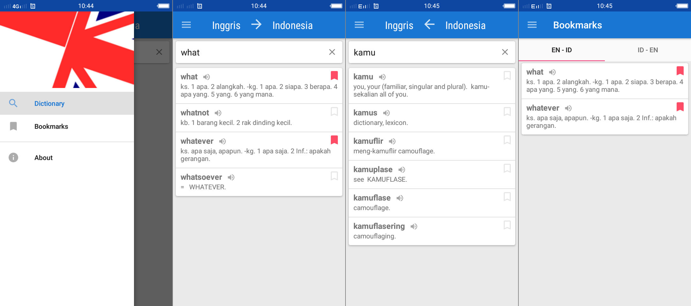

# Clean Architecture on Android (Kamus Inggris Indonesia)

## References

* [Uncle Bob - The Clean Architecture](https://8thlight.com/blog/uncle-bob/2012/08/13/the-clean-architecture.html)

* [Google Sample of Clean Architecture](https://github.com/googlesamples/android-architecture/tree/todo-mvp-clean/)

* [Fernando Cejas - Clean Architecture Sample](https://github.com/android10/Android-CleanArchitecture)

* Five - Android Architecture: [Part 1](http://five.agency/android-architecture-part-1-every-new-beginning-is-hard/) - 
[Part 2](http://five.agency/android-architecture-part-2-clean-architecture/) - [Part 3](http://five.agency/android-architecture-part-3-applying-clean-architecture-android/)

## Screenshot

